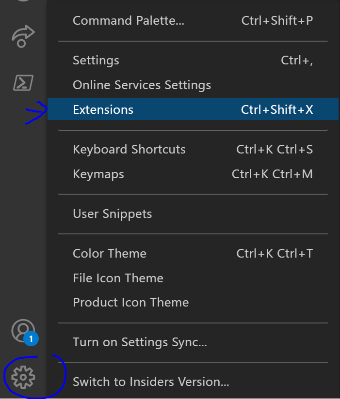
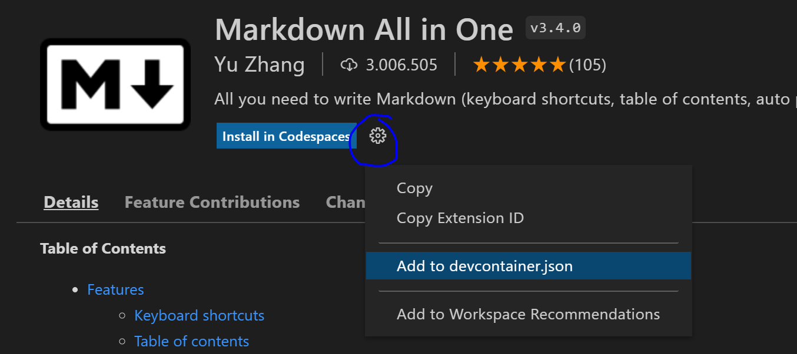

# 2.4 Using Codespaces on your repository
During this Technical Bootcamp, you have already had some hands-on experience working with Codespaces. In this hands-on lab, we'll dive a bit deeper and have the goal to extend your Codespaces installation with an extension you not already have installed. We will add this extension in a way that makes the extension persistent, meaning that when you start your Codespaces environment the next time you use it, the extension will also be loaded. This hands-on lab will allow you to further experience the benefits of working with Codespaces.

Navigate to your Codespace. If you have not yet started your Codespace, from your repository on the tab `Code`, click the `Code` button, select `Codespaces` and `New codespace`. Once you are in your Codespace, you can follow the next steps to add an extension to your Codespace.

Go to `Settings` (located on the bottem left side of your screen) and select `Extensions` 

Search for the term "*markdown*" and select the "*Markdown all in one*" extension.

Do not click `Install in Codespaces`, as this will only install the extension for now. Instead, click the settings wheel and select `Add to devcontainer.json`. 

You'll get a pop-up stating "*We've noticed a change to the devcontainer configuration. Rebuild the container to apply them now*". So, you will need to rebuild the container. 
Click on the `Rebuild now` option on the pop-up. If you missed this, you can of course still manually start a rebuild. Open the Command Palette (ctrl-shift-p/cmd-shift-p) in your Codespace and type "*Rebuild Codespace*". [More information can be found here](https://docs.github.com/en/codespaces/customizing-your-codespace/configuring-codespaces-for-your-project#applying-changes-to-your-configuration).

Great job! :thumbsup: You've now added an extension to the Codespaces container in a way that will ensure this extension is always available when you open your Code Space. So, next time you open your Code Space - this extension will be available without any manual intervention.
